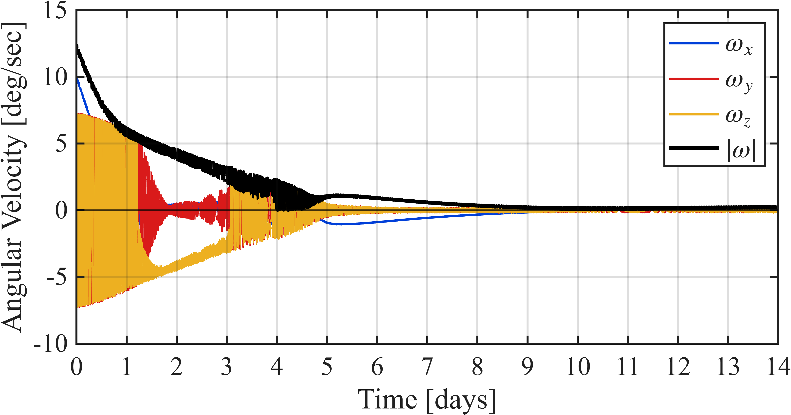
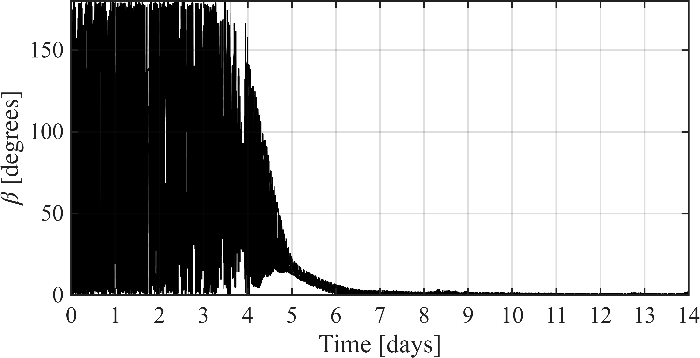
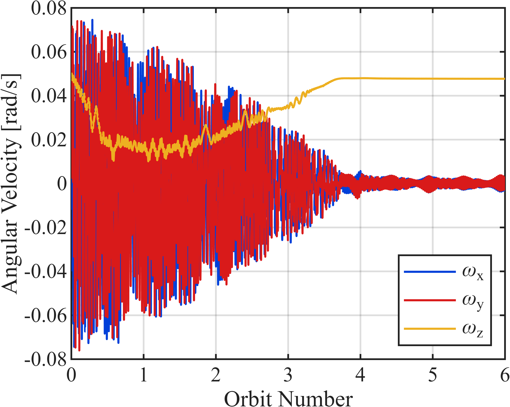
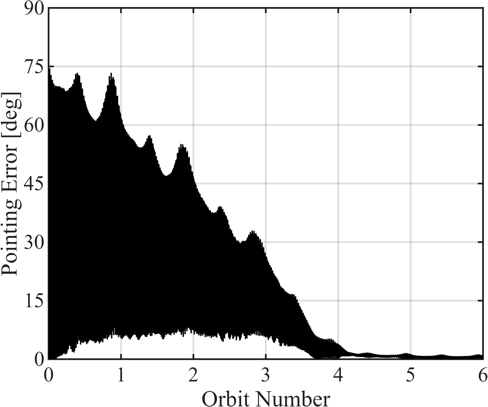
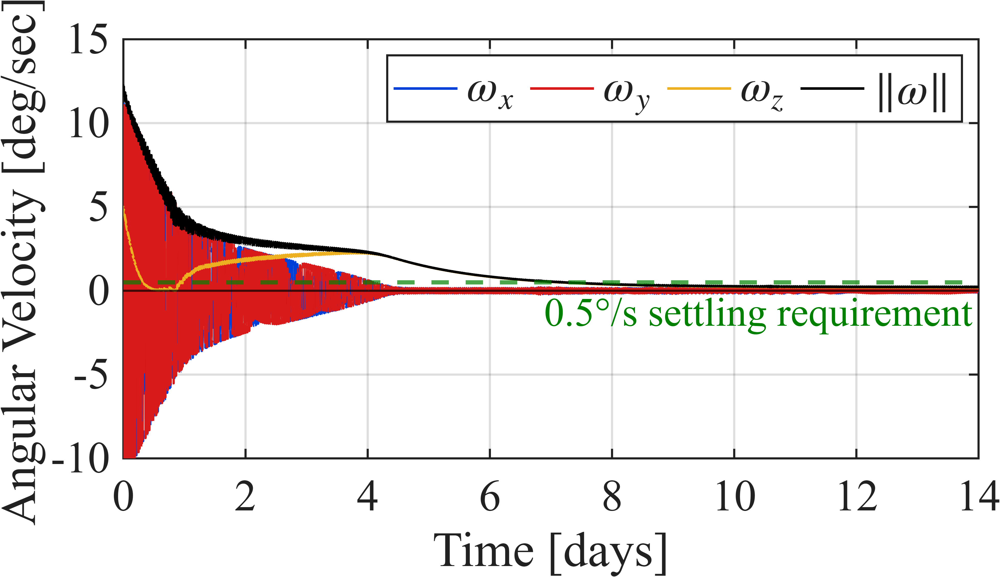
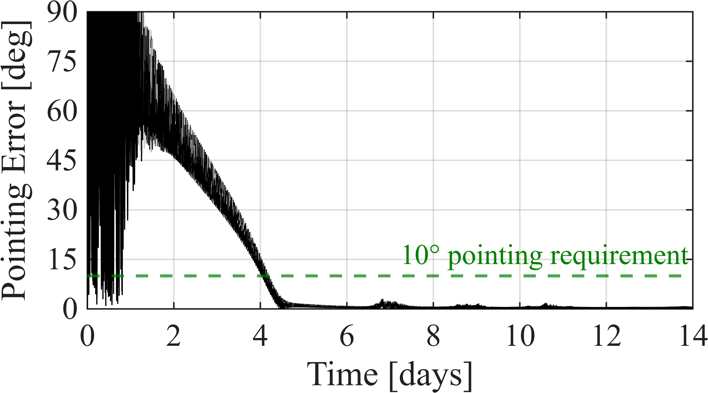
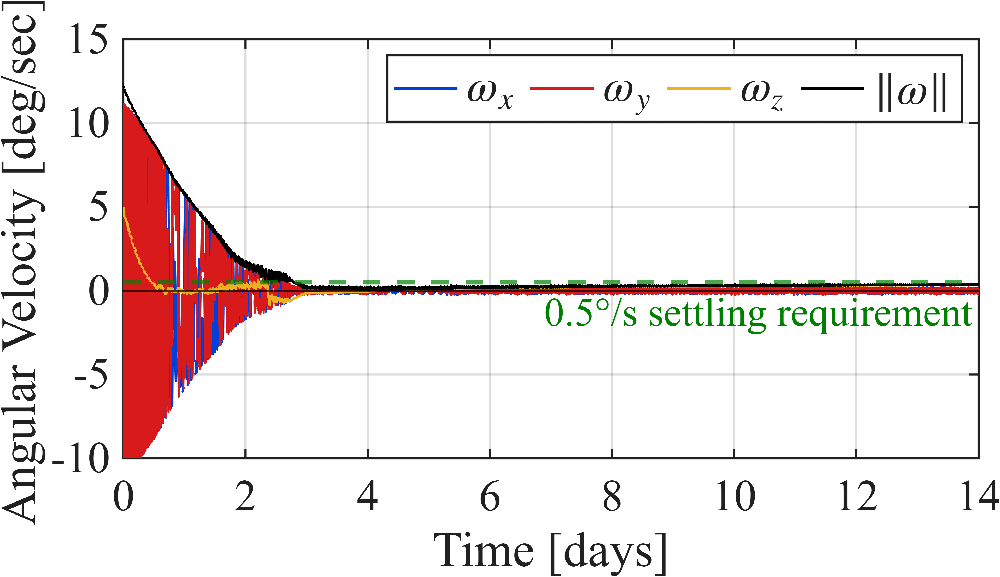
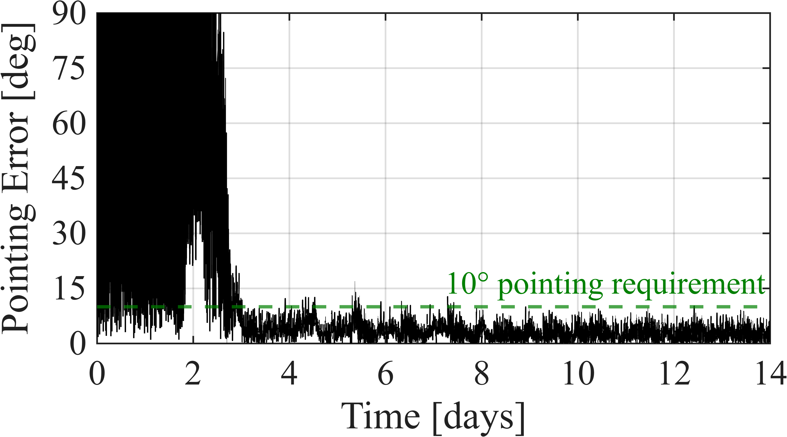
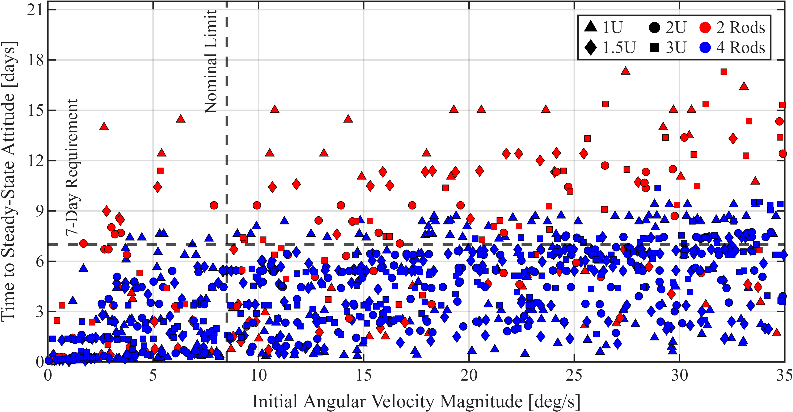

# GASRATS LGVI Magnetic Attitude Control Simulations

MATLAB simulation repository for publication "Validated Lie Group Variational Integrator-Based Simulator for Passive Magnetic Attitude Control of the GASRATS CubeSat" in the 40th annual Small Satellite Conference. Long-duration attitude simulations are necessary for confirming a passive magnetic attitude (PMAC) control system design for the Get Away Special Radio and Antenna Transparency Satellite (GASRATS). While Runge-Kutta solvers can accumulate numerical error in long-duration simulations, Lie group variational integrators offer excellent energy preservation provided by their formulation on a discrete variational principle. A Lie group variational integrator-based simulator is developed, validated against results from literature, compared to a validated quaternion Runge-Kutta simulator, and subjected to a 1,001-trial Monte Carlo study that tests eight CubeSat size and PMAC configurations. 

## Repository Structure

- `AttitudeSim001_RK45_CSSWE_Validation/`  
  Validation of a quaternion RK45 attitude simulator with magnetic hysteresis against results from Gerhardt's "Passive Magnetic Attitude Control for CubeSat Spacecraft" (2010).
  

    
    
  

- `AttitudeSim002_LGVI_RAX_Validation/`  
  Validation of a Lie group variational integrator-based attitude simulator with magnetic hysteresis against results from Park et al.'s "A Dynamic Model of a Passive Magnetic Attitude Control System for the RAX Nanosatellite" (2010).
  

    
    
  

- `AttitudeSim003_RK45_GASRATS_CrossFramework/`  
  Simulation of GASRATS-3U using the validated quaternion RK45 attitude simulator with magnetic hysteresis for a cross-framework verification study.
  

    
    
  

- `AttitudeSim004_LGVI_GASRATS_CrossFramework/`  
  Simulation of GASRATS-3U using the validated Lie group variational integrator-based attitude simulator with magnetic hysteresis for a cross-framework verification study.
  

    
    
  

- `AttitudeSim005_LGVI_GASRATS_MonteCarlo/`  
  Large-scale 1,001-trial Monte Carlo on the Lie group variational integrator-based attitude simulator with magnetic hysteresis for eight different sizing and magnetic control configurations.
  

    
  

- `Conference_Paper/`  
  Conference paper associated with this repository, "Validated Lie Group Variational Integrator-Based Simulator for Passive Magnetic Attitude Control of the GASRATS CubeSat." Selected for publication in the 40th annual Small Satellite Conference; finalist in the 34th Annual Frank J. Redd Student Competition. 

## Requirements

- MATLAB
- Aerospace Toolbox
- Parallel Computing Toolbox for Monte Carlo simulations

## Main Outputs

The simulations generate pointing-error plots, angular-velocity plots, hysteresis-loop plots, and Monte Carlo lock-time results.

## Large Files

Large IGRF cache files and some raw `.mat` simulation histories are excluded from this repository because of GitHub file-size limits. They can be regenerated by running the corresponding MATLAB scripts.

## Conference Paper

This repository accompanies:

**Validated Lie Group Variational Integrator-Based Simulator for Passive Magnetic Attitude Control of the GASRATS CubeSat**

Paper PDF: [`SSC26-VIII-01_SmallSat40_Abbe.pdf`](Conference_Paper/SSC26-VIII-01_SmallSat40_Abbe.pdf)

The full reference list for the validation models and background literature is included in the conference paper.

## Citation

If you use this code or build on this repository in academic work, please cite:

Truman T. Abbe, "Validated Lie Group Variational Integrator-Based Simulator for Passive Magnetic Attitude Control of the GASRATS CubeSat," Small Satellite Conference, 2026.

## License

This project is released under the MIT License. See [`LICENSE`](LICENSE).

## Author

Truman T. Abbe  
Utah State University

Contact: truman.abbe23@gmail.com